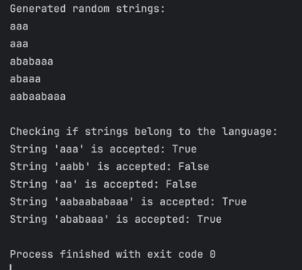

# Laboratory Work 1

### Course: Formal Languages & Finite Automata
### Author: Ciprian Moisenco

----

## Theory
In this laboratory work we had to implement a finite automaton.The finite automaton is a simple machine that can be in one of a finite number of states and can transition from one state to another based on input.

A finite automaton has a set of states, a set of input symbols, a transition function that maps a state and input symbol to a new state, a start state, and a set of accept states. When given an input string, the finite automaton reads the input symbol by symbol and transitions from state to state according to the rules.
## Objectives:
1. Understand what a language is and what it needs to have in order to be considered a formal one.


2. Provide the initial setup for the evolving project that I will work on during this semester. Basically I need to do the following:
    - Create a local && remote repository of a VCS hosting service;
    - Choose a programming language;
    - Create a separate folder where I will be keeping the report;


3. According to my variant number (by universal convention it is register ID), get the grammar definition and do the following tasks:
   - Implement a type/class for your grammar;
   - Add one function that would generate 5 valid strings from the language expressed by your given grammar;
   - Implement some functionality that would convert and object of type Grammar to one of type Finite Automaton;
   - For the Finite Automaton, please add a method that checks if an input string can be obtained via the state transition from it;

## Implementation description

### 1. Grammar Class

The `Grammar` class represents a regular grammar with a set of non-terminal symbols (`vn`), terminal symbols (`vt`), production rules (`p`), and a start symbol. The generate_string method produces random strings based on the production rules by iteratively replacing non-terminals with their corresponding derivations until only terminal symbols remain.
```python 
import random
class Grammar:
    def __init__(self):
        self.vn = {'S', 'A', 'B', 'C'}
        self.vt = {'a', 'b'}
        self.p = {
            'S': ['aA', 'aB'],
            'A': ['bS'],
            'B': ['aC'],
            'C': ['a', 'bS']
        }
        self.start_symbol = 'S'

    def generate_string(self):
        string = self.start_symbol
        while any(v in string for v in self.vn):
            for v in string:
                if v in self.vn:
                    string = string.replace(v, random.choice(self.p[v]), 1)
                    break
        return string
```

### 2. `to_finite_automaton()` function

The `to_finite_automaton` method converts the regular grammar into a finite automaton by defining states, an alphabet, transitions, and final states. The method maps production rules to state transitions, ensuring that terminal symbols reaching a final state (`qf`) represent valid strings in the language.
```python
    def to_finite_automaton(self):
        states = self.vn | {'qf'}  #q
        alphabet = self.vt #sigma
        start_state = self.start_symbol #delta
        transitions = {} #q0
        final_states = {'qf'}  #F

        for key in self.p:
            for rule in self.p[key]:
                if (key, rule[0]) not in transitions:
                    transitions[(key, rule[0])] = set()

                if len(rule) == 1 and rule in self.vt:
                    transitions[(key, rule)].add('qf')  # terminal leads to final state
                elif len(rule) > 1:
                    next_state = rule[1] if rule[1] in self.vn else 'qf'
                    transitions[(key, rule[0])].add(next_state)

        return FiniteAutomaton(states, alphabet, transitions, start_state, final_states)
```

### 3. `FiniteAutomaton Class`

The `FiniteAutomaton` class models the finite automaton derived from the grammar. It consists of states, an alphabet, transition rules, a start state, and final states. The `string_in_language` method verifies whether an input string belongs to the language by processing its symbols through the transition rules and checking if the final state is reached.
```python
class FiniteAutomaton:
    def __init__(self, states, alphabet, transitions, start_state, final_states):
        self.states = states
        self.alphabet = alphabet
        self.transitions = transitions
        self.start_state = start_state
        self.final_states = final_states

    def string_in_language(self, input_string):
        current_states = {self.start_state} 

        for symbol in input_string:
            next_states = set()
            for state in current_states:
                if (state, symbol) in self.transitions:
                    next_states.update(self.transitions[(state, symbol)])
            if not next_states:
                return False 
            current_states = next_states  

        return bool(current_states & self.final_states)  # check if any state is final
```

### 4. Testing Part

The implementation is tested by generating five random strings using the grammar and checking whether predefined test strings are accepted by the finite automaton. The output demonstrates how the generated strings conform to the defined grammar and validates the correctness of the finite automaton’s acceptance mechanism.
```python
# Main 
grammar = Grammar()
finite_automaton = grammar.to_finite_automaton()

print("Generated random strings:")
for _ in range(5):
    print(grammar.generate_string())

print("\nChecking if strings belong to the language:")
test_strings = ["aaa", "aabb", "aa", "aabaababaaa", "ababaaa"]
for s in test_strings:
    print(f"String '{s}' is accepted: {finite_automaton.string_in_language(s)}")
```


## Conclusion
This implementation illustrates the connection between regular grammars and finite automata. It demonstrates how a grammar can be systematically converted into an automaton and used for language recognition. The results confirm that the finite automaton correctly validates input strings based on the given grammar rules.

### Results as code:
```python
Generated random strings:
aaa
aaa
ababaaa
abaaa
aabaabaaa

Checking if strings belong to the language:
String 'aaa' is accepted: True
String 'aabb' is accepted: False
String 'aa' is accepted: False
String 'aabaababaaa' is accepted: True
String 'ababaaa' is accepted: True

Process finished with exit code 0
```
### Results as screenshot:


## References
1. COJUHARI Irina, DUCA Ludmila, FIODOROV Ion. "Formal Languages and Finite Automata: Guide for practical lessons". Technical University of Moldova.
2. Presentation "Regular Language. Finite Automata" - TUM - https://drive.google.com/file/d/1rBGyzDN5eWMXTNeUxLxmKsf7tyhHt9Jk/view